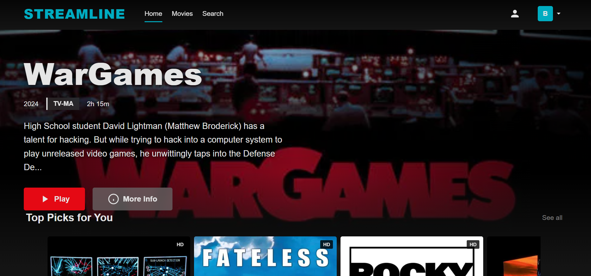
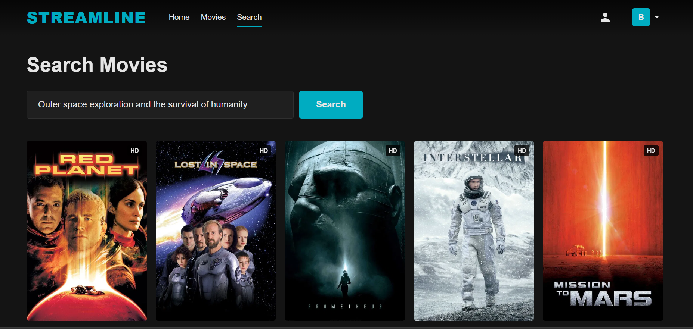

# Streamline: AI Movie Recommender

An undergraduate AI project for NUST featuring Semantic Search and Hybrid Recommendation logic.

## 🚀 Features
* **Semantic Search:** Find movies by describing plots using NLP (Sentence-Transformers).
* **Hybrid Recommendations:** Combines Content-Based and Collaborative filtering.
* **Multi-Profile:** Support for up to 5 user profiles with personalized watchlists.

## 📸 Screenshots



## 🛠️ Quick Start 

1. **Install Dependencies:**
   ```bash
   pip install flask pandas numpy scikit-learn sentence-transformers torch
   ```
2. **Initialize DB:**
   ```bash
   python api/db.py
   ```
3. **Run App:**
   ```bash
   python api/index.py
   ```

## 📂 Tech Stack
* **Backend:** Flask (Python)
* **Database:** SQLite
* **AI/ML:** PyTorch, Scikit-Learn
```

---

### **How to add the images *while* editing the README on GitHub:**
1.  **Upload first:** Before editing the README, go to your repo, click **Add file** -> **Upload files**, and upload your screenshots into a folder named `docs/images/`.
2.  **Edit README:** Now open the `README.md` editor.
3.  **Insert:** Click the **Image icon** in the GitHub toolbar or just keep the `` lines I put in the code above. 
4.  **Preview:** Click the **Preview** tab at the top of the editor to make sure the images appear before you hit **Commit**.

http://googleusercontent.com/interactive_content_block/0
